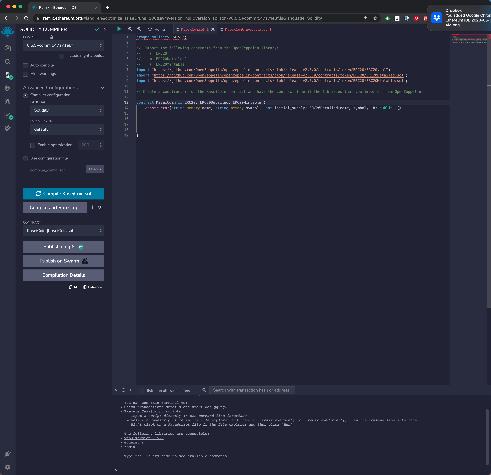
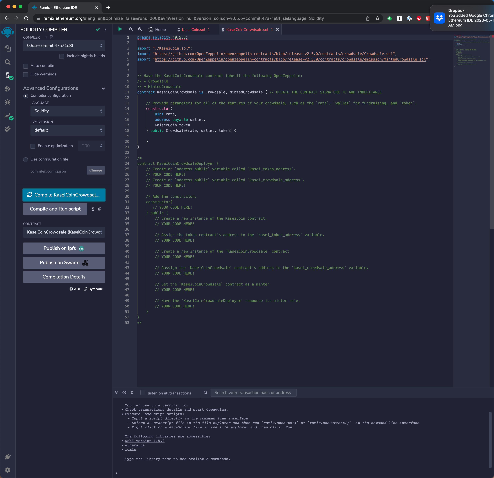
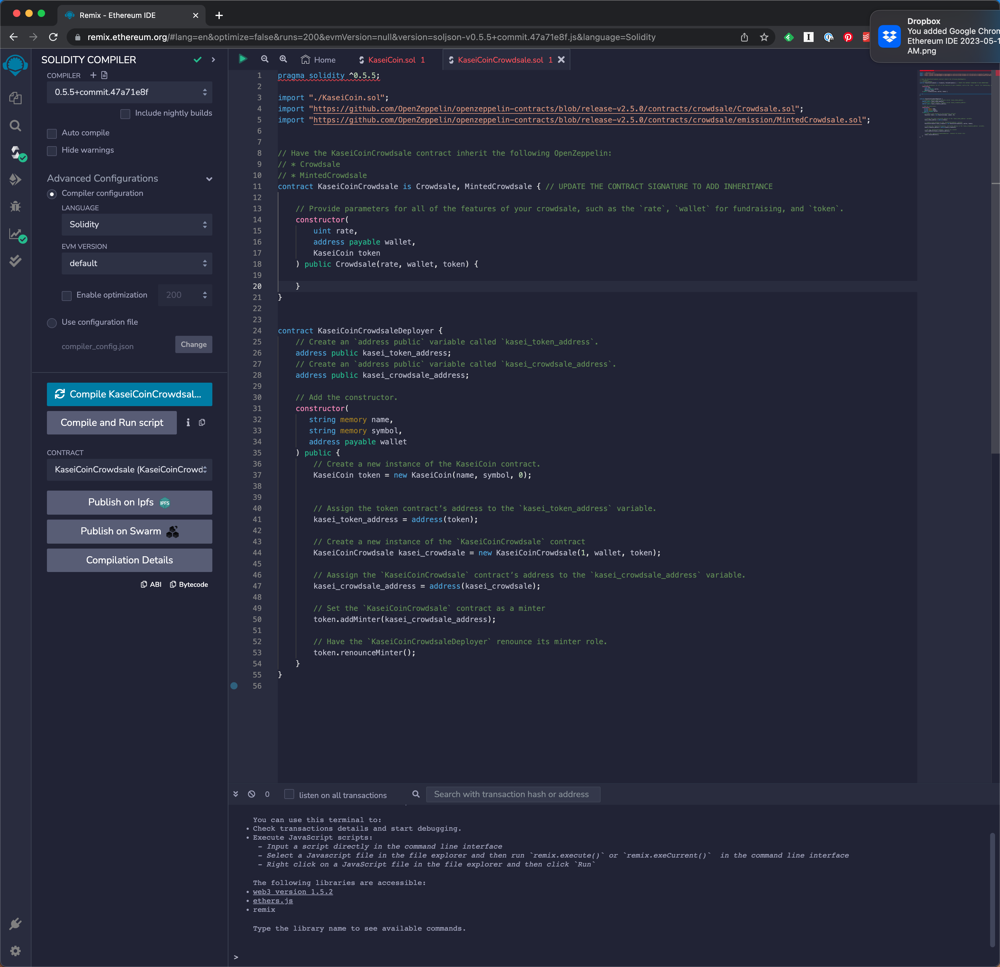
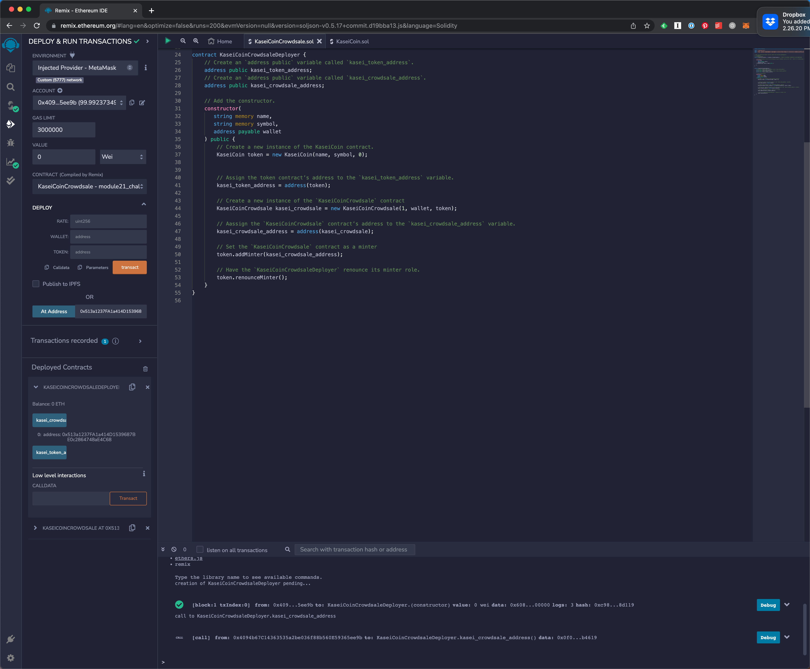
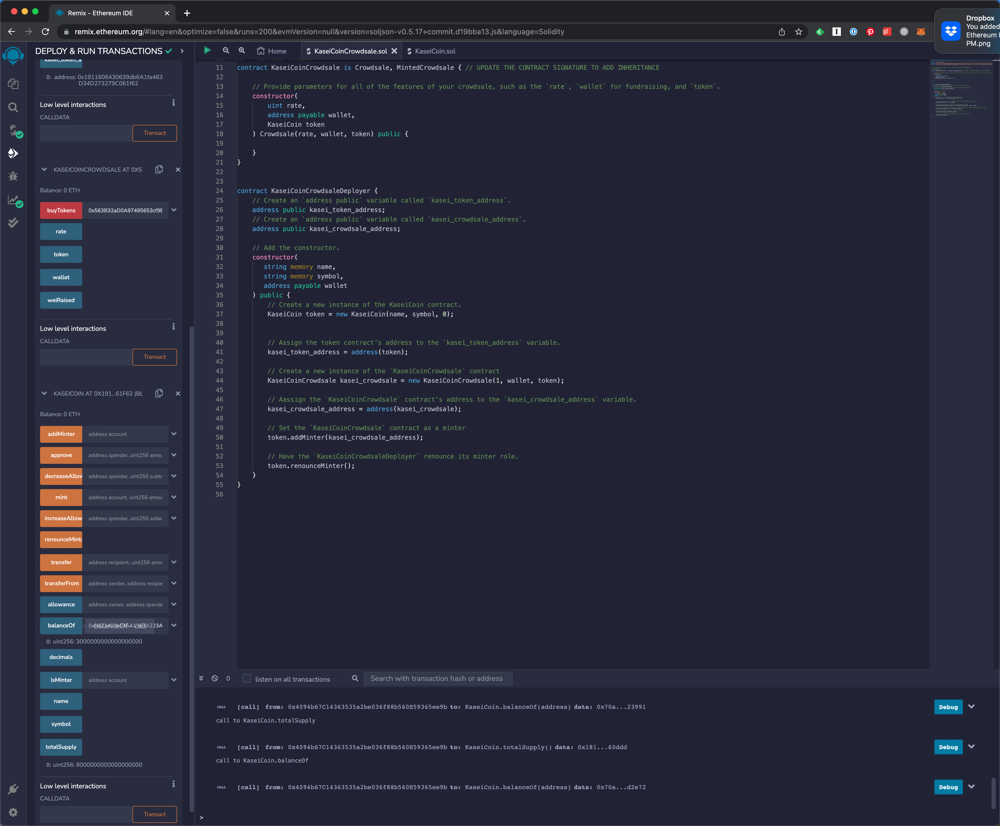
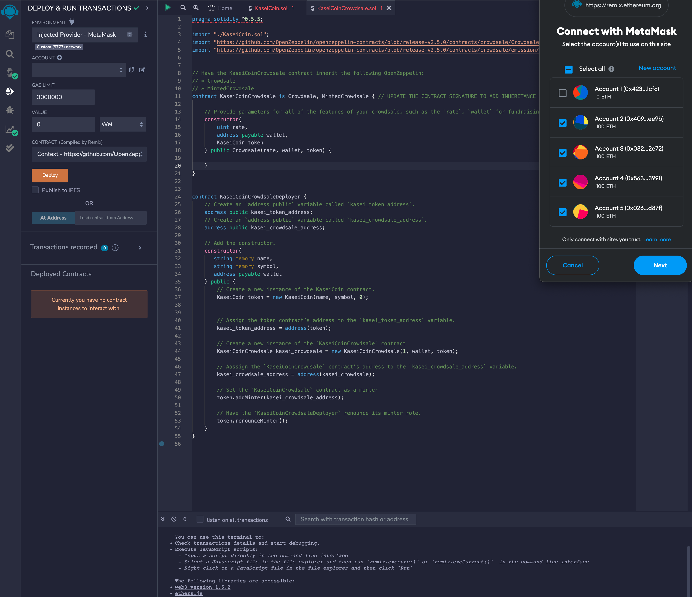
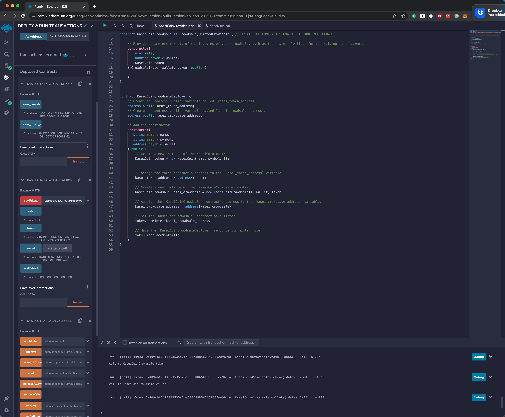
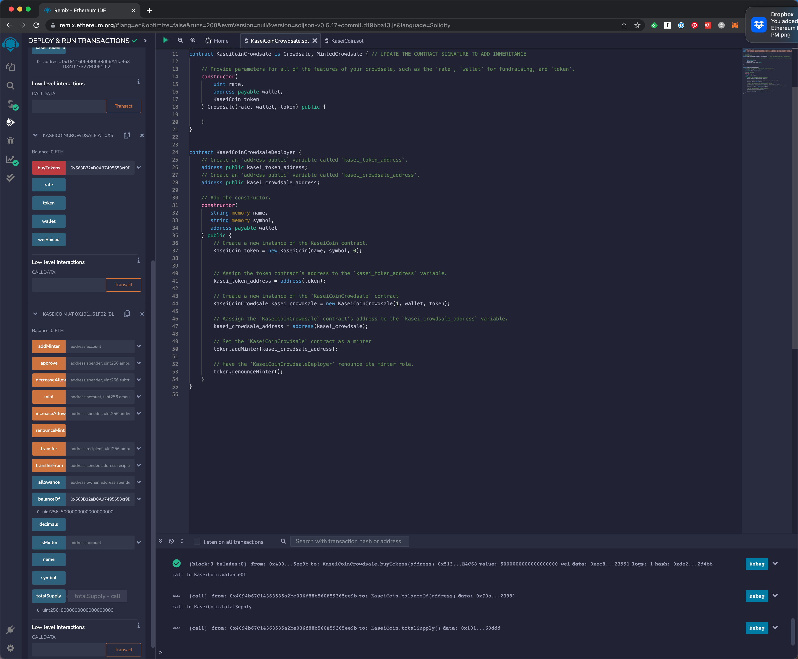

# Module 21 Challenge: Martian Token Crowdsale

This project creates a fungible token that is ERC-20 compliant and that can be minted by using a `Crowdsale` contract from the OpenZeppelin Solidity library.

The crowdsale contract manages the entire crowdsale process, allowing users to send ether to the contract and in return receive KAI, or KaseiCoin tokens. The contract can mint the tokens automatically and distribute them to buyers in one transaction.

## Evaluation Evidence

#### Create the KaseiCoin Token Contract

Screenshot of the successful compilation of the contract:

### Create the KaseiCoin Crowdsale Contract

Screenshot of the successful compilation of the contract

#### Create the KaseiCoin Deployer Contract

Screenshot of the successful compilation of the contract:

#### Deploy the Crowdsale to a Local Blockchain

1. Deploy the crowdsale to a local blockchain with Remix, MetaMask, and Ganache.

2. Test the functionality of the crowdsale by using test accounts to buy new tokens and then checking the balances associated with those accounts.

3. After purchasing tokens with one or more test accounts, view the total supply of minted tokens and the amount of wei that has been raised in the crowdsale contract.

